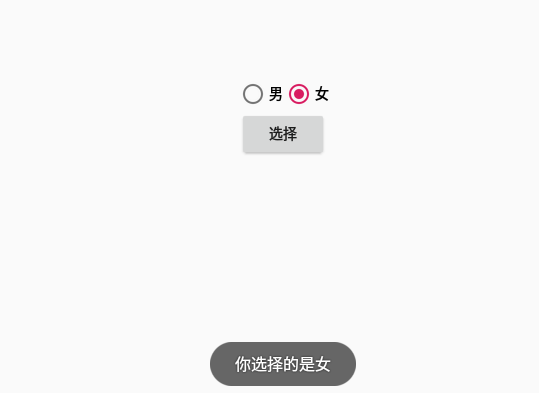

# 基础控件

## TextView


## ImageView

该控件具有设置图片两个属性，**src** 和  **background**  

- src指内容 ，background 指背景
- background 会拉伸，src 根据图片大小填充
- src 和 background 可以同时使用
- 代码设置图片

## RadioButton 

该控件和RadioGroup 配合使用常用方法如下

- getChildCount()  
- getChildAt(i)
- isChecked() 

```java
RadioGroup sexGroup = findViewById(R.id.sexGroup);
sexGroup.setOnCheckedChangeListener((group, checkedId) ->{
	RadioButton radioButton = findViewById(checkedId);
	Toast.makeText(this, "你选择的是"+radioButton.getText(), Toast.LENGTH_SHORT).show();
  });
```




## CheckBox 

- setOnCheckedChangeListener()


## ToggleButton & Switch

- textOn
- textOff
- setOnCheckedChangeListener()

## ProgressBar

显示类型需要通过Style来设置。

## SeekBar

- thumb 设置进度标识样式

- Drawable 属性


## RatingBar 

- isIndicator 是否仅作演示
- NumStarts 数量
- Rating 评分值 浮点型
- StepSize 增加的量
- OnRatingBarChangeListener

## ScrollBar 

- fullSroll ()  :ScrollView.**FOCUS_DOWN** ,ScrollView.**FOCUS_UP**
- android:**scrollbarThumbVertical** 设置滑块图片

## Adapter


**ArrayAdapter**

> 支持泛型操作，最简单的adapter

​	当需要设置选择类型时候，必须设置ListView的setChoiceMode

```java
listView.setChoiceMode(AbsListView.CHOICE_MODE_MULTIPLE);
```


**SimpleAdapter**

> 具有良好的扩展性,使用List<Map<String,?>> 结构存放数据。

**BaseAdapter**

> 抽象基类，需要自定义adapter通常继承它。

- convertView
- viewHolder
- inflate

## ListView

listView 复用原理：每一个item显示时都需要调用adapter的getView方法一次，此方法传入一个convertView参数，返回一个将会显示view对象，如果当item数量非常多时，若在在为每一个item都创建一个view对象，会造成内存开销过大。LayoutInflater.inflater()从XML读取属于IO操作也会造成耗时，必将影响性能。

​	android提供了一个叫做**Recycler**的构件，当滚动时超出屏幕上面的item将会被缓存到Recycler中，对应将会显示区域的下方生成一个Item，同时调用getView方法将Recycler中的item作为convertView参数传递到方法中去。所有重用convertView会提升性能。

​	

### issue

​	如果使用了recycler缓存机制，新加载的item由于是复用之间隐藏的item将会出现控件属性还是之间item的，造成状态混乱。

​	


## Layout

1. layout继承关系
2. LinearLayout

   - 常用控件属性

     - Orientaion

     - gravity

     - layout_gravity

     - layout_width

     - layout_height

     - background

     - weight
   - Divider
     - divider
     - showDividers
     - dividersPadding 
3. 布局方式练习 代码方式显示
4. RelativeLayout
   - 控件属性

#### LinearLayout


LinearLayout是一个控件容器，用于将容器内的子元素按照指定的方向(水平或者垂直)线性排列。LinearLayout 继承自ViewGroup，呈线性显示它的子元素，水平排列一行或者垂直显示一列Views。

##### orientation

```xml
<LinearLayout xmlns:android="http://schemas.android.com/apk/res/android"
   android:layout_width="match_parent"
   android:layout_height="match_parent"
   android:orientation="vertical">
 </LinearLayout>
```

​	通知设置 `android:orientaion` 属性设置 水平( **horizontal **)显示和垂直(**vertical**)显示。


​				

​						


##### layout_width & layout_height

该属性值分为四种

- wrap_content
- match_parent
- ~~fill_parent~~
- 固定值 dp


##### gravity (容器里子控件的对齐方向） 

常用7种属性值

- Top 上
- Bottom 下
- Left 左
- Right 右
- center 水平垂直居中
- center_horizontal 水平居中
- center_vertical 垂直居中

##### ****layout_gravity

控件在父容器的对其方式


##### weight(布局权重）

用于线性布局种的控件分配剩余空间比例权重。


##### 嵌套使用	


##### Margin & padding


##### Divider 

- divider
- showDividers
- dividerPadding


##### 练习


#### RelativeLayout


##### 梅花布局


## Spinner

```xml
<Spinner
    android:layout_width="wrap_content"
    android:layout_height="wrap_content"
    android:spinnerMode="dialog" <--dropdown-->
    android:entries="@array/tool">
</Spinner>
```


## ExpandableListView

- ExpandableAdapter 存放group以及group的子元素

## ProgressDialog

```java
ProgressDialog progressDialog = ProgressDialog.show(this, "提示", "加载中...");
ProgressDialog progressDialog = new ProgressDialog(this);
```

第一种的方式不能更改progress样式。	


## 事件处理的5种方式

- 内部类形式
- 外部类形式
- Activity本身作为事件监听器类
- 匿名内部类形式
- 直接绑定到标签

## Handler

> Handler 发送消息(Message) 到消息队列中(MessageQueue) ，Looper 通过无限循环的方式不断向消息队列中获取新添加的消息 然后交给 Handler ，最终消息回到 Handler 中被处理
>
>

#### 耗时 - 线程安全

#### 线程生命周期

#### MainThread & WorkerThread

#### ANR

#### Message

- obj
- what

#### MessageQueue （消息队列）

- 容器
- 添加 queue.enqueueMessage(msg, uptimeMillis)
- 消费


#### Looper

)

线程分为主线程(主线程又叫UI线程，只能有一个主线程）和子线程（可以有多个）Handler只能在主线程里运行 
handler是Android给我们提供用来更新UI的一套机制，也是一套消息处理机制，我们可以发消息，也可以通过它 处理消息。 谷歌采用了只允许在主线程更新UI。

- 子线程中修改UI，耗时操作，网络操作，handler修改UI
- runOnUiThread()
- handler.post()
- handler.sendMessage()
- handler.sendEmptyMessage()
- loop()
- 


mHandler


1. 演示ANR (耗时操作)
2. 线程安全
3. Handler
4. handler常用使用方式
5. Looper Message MessageQueue
6. 练习


##### Hnadler 常用方法

1. sendMessage(msg)  
2. sendEmptyMessageDelayed(what , 0)
3. sendEmptyMessage(what)
4. post(runnable)


##### Activity 方法

runOnUIThread


